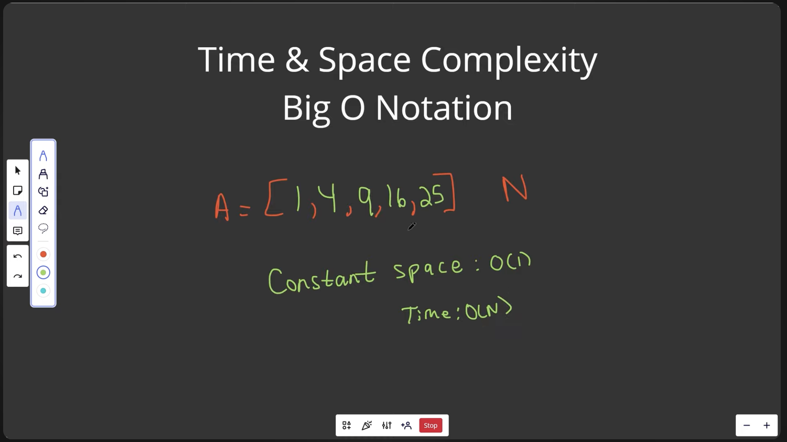
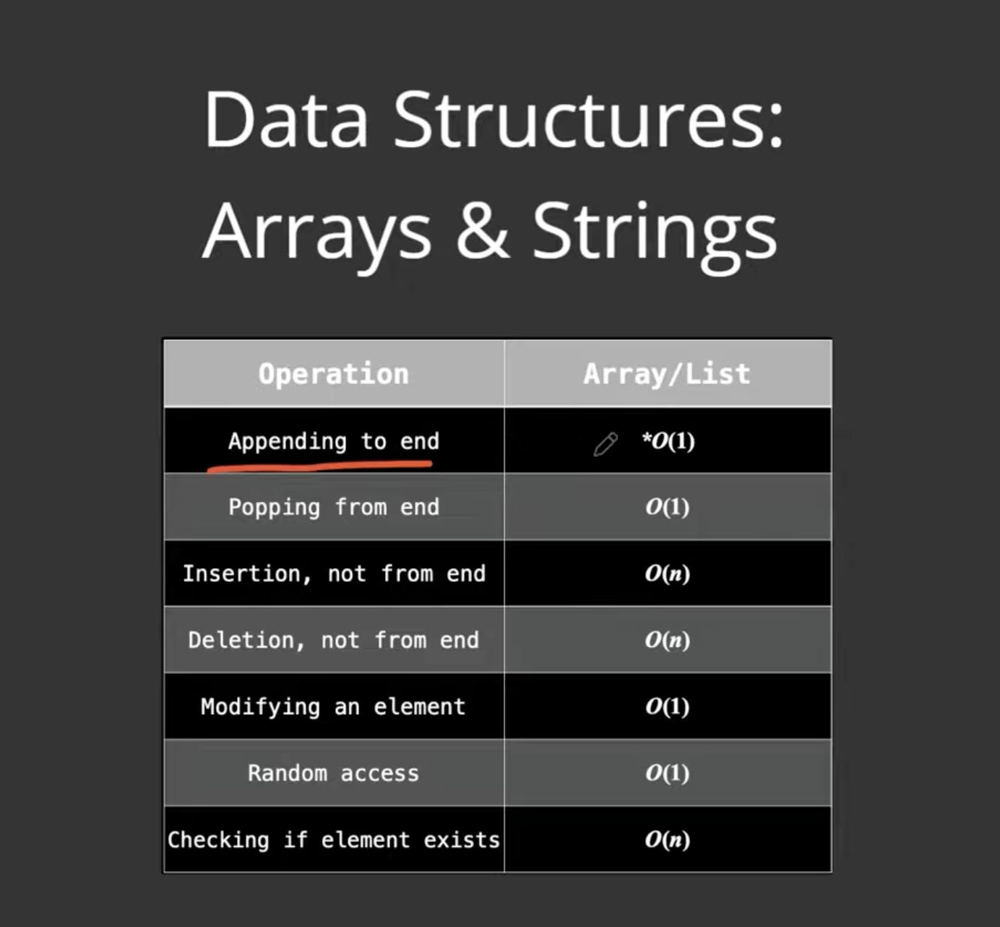
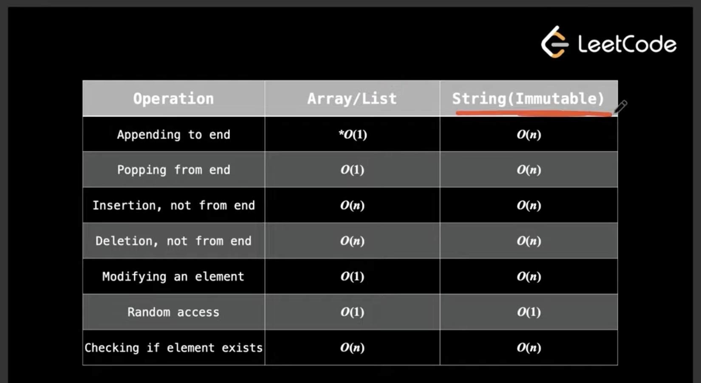

#### TIME COMPLEXITY

arr = [1,2,3,4,5]

If we loop over one time, it's O(n) time complexity. Like finding squares of all the numbers

#### SPACE COMPLEXITY

arr = [1,2,3,4,5]
arr_s = [1,4,9.16.25]

suppose we changed from arr to arr_s by squaring all the elements - so it was a constant space operation O(1)
time complexity will be O(n)

#### EXAMPLE

getting an element from an array is an O(1) operation, you just get what you need to get. It doesn't depend on the number of elements

---

### STATIC ARRAYS

Static arrays have fixed size, you cannot add any element. Python has lists

- leave some space after arrays, as inserting a new element is a constant time operation
- otherwise, first copy the elements into a new, bigger array and then add the ones needed after it
- copying is an O(n) opearation
- what python does is increase in powers of two, first size 2 -> 4 -> 8 -> 16 -> 32 .... as soon as elements are filled
- checking the length of an array is O(1) in python

### DYNAMIC ARRAYS

Python lists are dynamic arrays

---

### STRINGS

Strings are immutable in python

- same goes for adding to a string, as strings are immutable in python, you have to copy it O(n) -> and then add at the end in another variable
- you can access something at a position in O(1), called random access
- checking the length of an string is also O(1) in python

